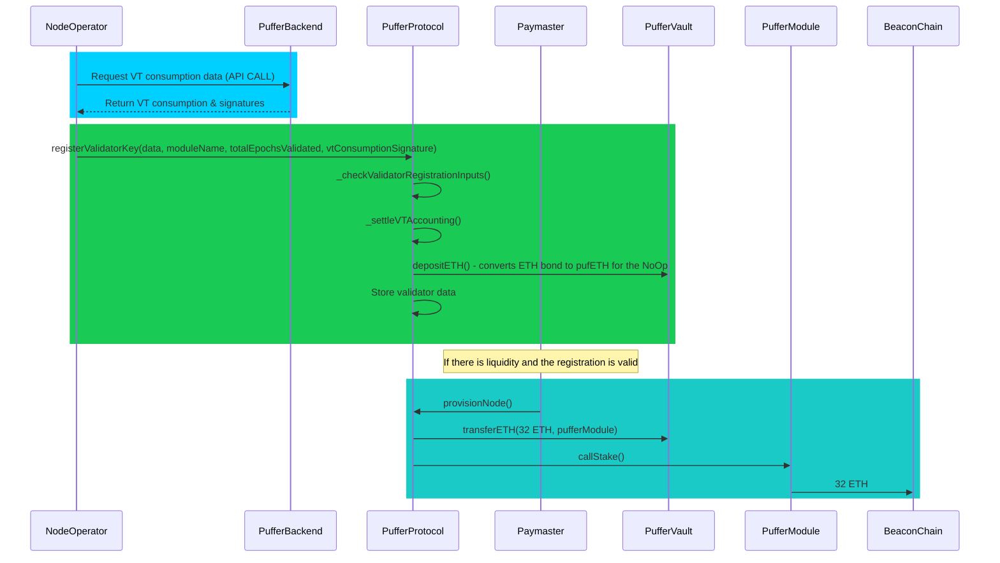
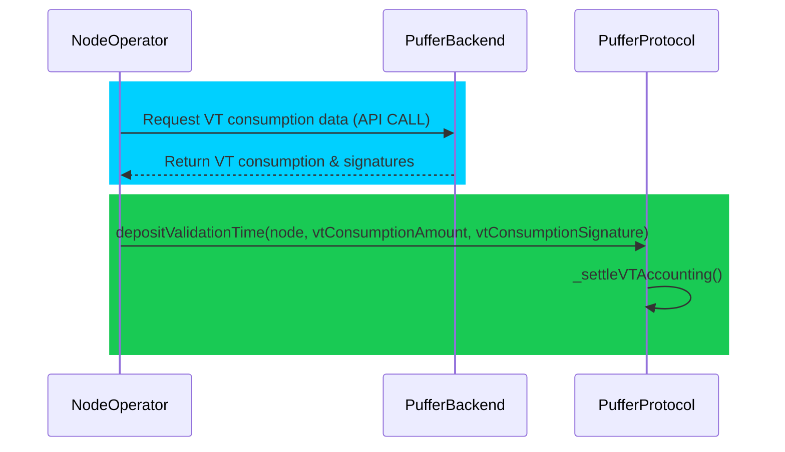

# PufferProtocol
The `PufferProtocol` serves as the central contract and fulfills three key functions:

- **Validator State Management**: Including overseeing accounting processes, as well as handling the custody of validator bonds and Validator Tickets [VTs](./ValidatorTicket.md).
 
- **Validator Interactions**: Including the registration of new validators and managing their exit from the protocol.

- **Routing ETH**: The protocol directs ETH from the ER4626 vault to EigenPods to fund natively restaked Ethereum validators.


## Overview


0. **Initial Deposit and Minting**: (Not pictured) Stakers deposit ETH into the `PufferVault` to mint pufETH. This ETH funds Ethereum staking and EigenLayer restaking. Similarly, Node Operators (NoOps) use pufETH for their bonds.
1. **Validator Registration**: NoOps submit a transaction to register their validator, locking in their bond and VTs.
2. **Verification by Guardians**: The Guardians perform an off-chain verification to confirm the registration's validity.
3. **Requesting Funds**: The `PufferProtocol` contract requests 32 ETH from the `PufferVault`.
4. **Transfer to PufferModule**: The requested 32 ETH is transferred to a `PufferModule`.
5. **Initiating Validator Deposit**: The `PufferProtocol` proceeds to initiate a validator deposit.
6. **Deposit Request to EigenLayer**: The `PufferModule` requests a validator deposit from EigenLayer.
7. **EigenLayer Deposit Initiation**: EigenLayer initiates the deposit process.
8. **Beacon Chain Interaction**: The 32 ETH along with the validator deposit message are sent to the Beacon chain deposit contract.
9. **Completion and Restaking**: Once the Beacon chain recognizes the validator, a withdrawal credentials merkle proof is submitted back to EigenLayer to enable the restaking of the validator's ETH.


## Registering a validator
### 1. Prepare Bond and VTs 
NoOps are required to send enough ETH to cover for the validator bond and the validation time.

1.5 ETH is the bond amount required. + 30 days of validation time.

<!--  -->

The `PufferProtocol` contract mandates a minimum number of VTs at registration, set at `minimumVtAmount = 28`. This minimum commitment, equivalent to a 4-week operation, ensures efficient allocation of staker ETH. VTs can be minted from the [ValidatorTicket](./ValidatorTicket.md) contract or obtained from the secondary market as they are ERC20s.


### 2. Prepare inputs
> ```javascript
> function registerValidatorKey(
>     ValidatorKeyData calldata data,
>     bytes32 moduleName,
>     uint256 totalEpochsValidated,
>     bytes[] calldata vtConsumptionSignature
> )
> ```

Before calling `registerValidatorKey`, Node Operators must first obtain their VT consumption data from the Puffer Backend API. This data includes:
- Total epochs validated by their active validators
- A signature from the Guardians verifying this data



The NoOp must supply the following `ValidatorKeyData` struct created off-chain:

- **`bytes blsPubKey`**: [BLS public key](https://ethereum.org/en/developers/docs/consensus-mechanisms/pos/keys/) generated by the NoOp.

- **`bytes signature`**: Signature of the deposit data by the validator's BLS private key.

- **`bytes32 depositDataRoot`**: Root hash of the deposit data.

- **`bytes[] blsEncryptedPrivKeyShares`**: Array of encrypted private key shares [for each Guardian](https://docs.puffer.fi/protocol/guardians#what-are-their-duties).

- **`bytes blsPubKeySet`**: Used to reconstruct the BLS public key shares.

- **`bytes raveEvidence`**: Remote attestation evidence if using an enclave, checked for validity by the Guardians.

Additional details to supply:
- **`bytes32 moduleName`**: Name of the `PufferModule` for which the validator is registering. The `PufferModule` must be registered with the `PufferProtocol` contract (created via the [`PufferModuleManager`](./PufferModuleManager.md) factory).
- **`pufETHPermit` and `vtPermit`**: Permit data for pufETH and `ValidatorTicket` tokens. Direct ETH can be sent for minting or existing tokens can be approved for transfer.

### 3. Call registerValidatorKey()
This function allows flexibility in how pufETH and VTs are supplied. Options include:
- Sending ETH directly for minting pufETH and VTs.
- Transferring pufETH and VTs using Permit messages or prior approve transactions.
- Combining both methods (e.g., minting pufETH and transferring VTs).

#### Registration side effects
Successful registration adds the validator to the `PufferModule` queue. Guardians verify the data and manage keyshare custody. Once verified, they provision the validator with 32 ETH from the `PufferVault` to deploy to the  `PufferModule's` `EigenPod`.

## Provisioning a validator
Once a quorum of Guardians verifies the validity of a registration, the `provisionNode` function is called to provision the validator with 32 ETH. The provisioning process will proceed if the following conditions are met:

- The registration data, including withdrawal credentials and deposit message, is validated.
- The `PufferVault` has sufficient liquidity (at least 32 ETH available).
- The BLS public key has not been previously used.
- The RAVE evidence is valid (for enclave validators).
- The `PufferModule` has capacity to accommodate the new validator.
- If any registration is invalid, Guardians can utilize the `skipProvisioning` function on the `PufferProtocol`. This action dequeues the validator's registration, refunds their bond, and burns `vtPenalty` VTs to deter attempts to grief the protocol.

The `provisionNode` function executes several critical steps in one atomic transaction:

- It orchestrates the transfer of 32 ETH from the `PufferVault` to the `PufferModule`, then to the `EigenPod`, and finally to the Beacon Chain Deposit contract.
- It updates the `_numberOfActivePufferValidators` counter on the `PufferOracleV2` contract, reflecting the addition of a new validator on the beacon chain.

#### Impact on pufETH Conversion Rate
- The provisioning of a validator involves transferring 32 ETH out of the PufferVault, which could negatively affect the pufETH:ETH conversion rate. To prevent this, the vault calculation includes the ETH amount locked as reported by `PUFFER_ORACLE.getLockedEthAmount()`. When provisioning occurs, the oracle contract's reported locked ETH amount is increased by 32 ETH. This adjustment ensures that the vault's exchange rate remains unchanged, despite the outflow of funds. For a more detailed explanation, refer to the [`PufferOracleV2`](./PufferOracleV2.md) documentation.

## Restaking a validator
Once a validator is onboarded into a `PufferModule` and their validator is observable from the Beacon chain, their Beacon chain ETH is restaked. This process involves delegating the validator's ETH to a [`RestakingOperator`](./RestakingOperator.md), as determined by the DAO. 

Restaking requires the submission of a Merkle proof to EigenLayer. This proof verifies that the validator's withdrawal credentials are correctly aligned with their designated `EigenPod`. The responsibility of calculating and submitting these Merkle proofs lies with the Guardians.

## Exiting a validator
Exiting a validator from the Puffer protocol involves broadcasting a signed voluntary exit message on the Beacon chain.

#### Node Operators
NoOps are free to initiate a voluntary exit at any point. However, if they choose to exit before the required `minimumVtAmount` days have elapsed, their VT balance will be subject to penalties.

#### Guardians
Guardians, utilizing their enclaves, are authorized to sign and broadcast voluntary exit messages for validators under specific circumstances:

- If a validator's balance falls below the `_ejectionThreshold` ETH, as defined in the [GuardianModule](GuardianModule.md).
- If the Node Operator fails to replenish their VTs after their locked amount has expired.

#### After exiting 
Post-exit, the exited validator's ETH will be redirected to the `PufferModule's` `EigenPod`. The [`PufferModuleManager`](./PufferModuleManager.md) oversees the full withdrawal process on EigenLayer, which involves Merkle proofs and queueing, to transfer the ETH back to the `PufferModule`.

The Guardians then execute `batchHandleWithdrawals()` on the `PufferProtocol`, which returns pufETH bonds to NoOps, burns their consumed VTs, and performs necessary [accounting](./PufferOracleV2.md). The process addresses three potential scenarios:

**Sufficient Withdrawal** (*withdrawalAmount* ≥ 32 ETH):
- 32 ETH is transferred back to the `PufferVault`.
- Any excess over 32 ETH remains in the `PufferModule` as rewards for the NoOp.
- The NoOp is reimbursed their full bond amount.

**Insufficient Withdrawal** (*withdrawalAmount* < 32 ETH):
- The entire *withdrawalAmount* is transferred back to the `PufferVault`.
- The missing ETH (32 ETH - *withdrawalAmount*) is burned from the NoOp's bond.
- The NoOp receives the remainder of their bond, assuming losses due to inactivity penalties do not exceed the bond itself.

**Validator Was Slashed**:
- All withdrawn ETH is transferred to the `PufferVault`.
- The entire bond is forfeited and burned, irrespective of the slashing amount.

In all scenarios, the `_numberOfActivePufferValidators` count on the `PufferOracleV2` contract is decremented atomically, reducing the locked ETH amount by 32 ETH per exited validator to maintain the pufETH conversion rate.

### Depositing Validation Time

Valiadtion time gives the node operator ability to keep operating their validator. If they run out of validation time, they will be ejected from the beacon chain. To prevent that from happening, they can deposit validation time. In the previous iteration of the protocol, validation time was represented as ERC20 token Validator Tickets (VTs). This is no longer the case, and the protocol now uses native ETH to represent validation time. The drawback of the previous design was that the node operator was left with VT tokens if ejected early because of the liquidity need for the protocol, and that forced them to sell their VT tokens on secondary markets for a lower price. The new design returns the ETH they deposit to the protocol, if they are ejected early. If they want to keep operating their validator, they can deposit more validation time. To do that, they can call the `depositValidationTime` function and send some amount of ETH to the protocol. That ETH is accounted for in the `PufferProtocol` contract, and the node operator can withdraw if when they exit all of their validators.



## Managing Validator Tickets (VT)
#### Understanding VT Consumption

Each validator operated by a NoOp consumes one VT per day. The VT consumption is tracked off-chain by the Guardians and verified through signatures. When registering a new validator, the NoOp must:

1. Query the Puffer Backend API to obtain:
   - Total epochs validated by their active validators
   - Guardian signatures verifying this data

This off-chain tracking approach is used to minimize gas costs while maintaining accurate VT consumption records. The `depositValidationTime` function is used to deposit validation time to the protocol. It is important to note that the calculation of the legaxy VT / new Validation Time is done off-chain, and per epoch. Currently, 1 day is equivalent to 225 epochs.

#### Off-Chain Tracking and Visualizing VTs
To efficiently manage VT consumption without incurring high on-chain costs, Guardians track VT usage off-chain. NoOps can access up-to-date VT consumption information through frontend interfaces, which provide a clear view of their current VT status.

#### Periodic VT Top-Up
Maintaining active validators requires more than just the initial deposit of a minimum of 28 VTs at registration. To ensure continuous operation and prevent ejection from the network, NoOp must periodically top up their VT balance. This is crucial as running out of VTs could lead to a validator being deactivated. 

#### Depositing Additional VTs
NoOps can replenish their VT supply by executing the `depositValidatorTickets(permit, nodeOperator)` function (legacy function) or the `depositValidationTime(node, vtConsumptionAmount, vtConsumptionSignature)`. This allows them to add VTs/Validation Time to their account, ensuring their validators can continue to operate without interruption. Note that the `PufferProtocol` tracks validators by wallet address, so only one function call is needed to top up VTs across all of your validators.

It's important for NoOps to monitor their VT consumption regularly and respond proactively to avoid disruptions in their validator operations.

#### Withdrawing VTs
Since VT consumption is tracked off-chain, withdrawing excess VTs, `withdrawValidatorTickets` can only be called when the NoOp has no active or pending validators (legacy function), the same logic applies to `withdrawValidationTime`. In future protocol upgrades, ZKPs will be used to allow VTs to be withdrawn while validators are still active.

## Validator Rewards in Puffer
#### Overview of Rewards
In the Puffer protocol, NoOps receive 100% of the consensus and execution rewards generated by their validators. This arrangement acknowledges the upfront commitment made by NoOps when purchasing VTs.

#### Execution Rewards
When NoOps employ tools like MEV-Boost, execution rewards are directly sent to their designated wallet addresses. This is specified through the `fee recipient` parameter. Unlike other protocols there is no need to share these rewards with the protocol.

#### Consensus Rewards
Consensus rewards are directed to the validators' withdrawal credentials, which are linked to `EigenPods`. These rewards accumulate and, following an upcoming EigenLayer upgrade that improves partial withdrawal gas-efficiency, will be accessible for claiming through the [PufferModules](./PufferModule.md#consensus-rewards). 

#### Restaking Rewards
Restaking rewards are claimed by the Puffer, they are periodically converted to ETH and then deposited to PufferVault. That is how Puffer is able to achieve higher yield compared to other protocols.